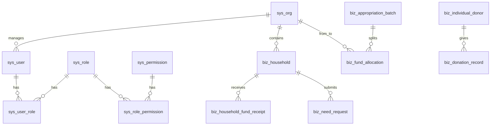

# 慈善资金追溯平台 — 数据库设计说明（模板）

> **用途**：表名、字段类型、索引、枚举值均可直接改；确认后可用于 Flyway/Liquibase 或手工建库。  
> **字符集建议**：`utf8mb4`（MySQL）或 UTF8（PostgreSQL）  
> **日期**：2026-05-10  

---

## 一、命名约定（可改）

- 表名：`snake_case`，业务前缀可选 `biz_`、`fin_`、`sys_` 等  
- 主键：统一 `id` BIGINT 自增或雪花（分布式用雪花）  

---

## 二、全局字段约定（所有表统一具备）

> **说明**：以下字段**每一张业务表、系统表、关联表**均须具备（若某表已有语义等价字段，可改名对齐，但不要在库中缺列）。  
> **`login_at`（登录时间）**：在 `sys_user` 上表示**该用户最后一次登录时间**；在其余表上可为 **NULL**（仅占位统一结构），或后续若你希望表示「本条记录最后经手人登录时间」再填业务规则。

| 字段名（建议） | 类型（示例） | 必填 | 说明 |
|----------------|--------------|------|------|
| `created_at` | DATETIME | Y | 创建时间 |
| `updated_at` | DATETIME | Y | 修改时间 |
| `login_at` | DATETIME | N | 登录时间（用户表必填更新；其它表可空） |
| `created_by` | BIGINT | N | 创建人，关联 `sys_user.id` |
| `updated_by` | BIGINT | N | 修改人，关联 `sys_user.id` |
| `deleted` | TINYINT | Y | 是否软删除：0 否，1 是（也可用 `deleted_at` DATETIME 非空即删，二选一在实现层统一） |

**索引建议**：`idx_deleted` 或 `(deleted, id)`，列表查询默认 `WHERE deleted = 0`。

**安全提示（必读）**：用户密码若存**明文**，数据库泄露即全盘失守；若坚持「管理员可找回密码」，至少应限制**仅超级管理员**可查看、操作审计全量留痕，并配合库加密/脱敏与最小权限。下文仍按你方要求写 `password` 明文字段。

---

## 三、RBAC 与系统支撑表

### 3.1 `sys_user`（用户）

| 字段名 | 类型（示例） | 必填 | 说明 |
|--------|--------------|------|------|
| id | BIGINT | Y | 主键 |
| username | VARCHAR(64) | Y | 登录名，唯一 |
| **password** | VARCHAR(255) | Y | **登录密码明文**（供管理员找回/查看；见上文安全提示） |
| real_name | VARCHAR(64) | N | 真实姓名 |
| phone | VARCHAR(20) | N | 手机 |
| org_id | BIGINT | N | 关联行政/机构节点，用于数据权限 |
| status | TINYINT | Y | 1 启用 0 禁用 |
| created_at | DATETIME | Y | 创建时间 |
| updated_at | DATETIME | Y | 修改时间 |
| login_at | DATETIME | N | **该用户最后登录时间**（每次登录成功更新） |
| created_by | BIGINT | N | 创建人 |
| updated_by | BIGINT | N | 修改人 |
| deleted | TINYINT | Y | 软删除 |

**索引**：`uk_username`，`idx_org_id`，`idx_status`，`idx_deleted`

---

### 3.2 `sys_role`（角色）

| 字段名 | 类型 | 必填 | 说明 |
|--------|------|------|------|
| id | BIGINT | Y | |
| code | VARCHAR(64) | Y | 角色编码，唯一 |
| name | VARCHAR(64) | Y | 显示名 |
| remark | VARCHAR(255) | N | |
| created_at / updated_at / login_at / created_by / updated_by / deleted | 同第二节 | Y/N 按约定 | |

**索引**：`uk_code`，`idx_deleted`

---

### 3.3 `sys_permission`（权限：菜单/按钮/API）

| 字段名 | 类型 | 必填 | 说明 |
|--------|------|------|------|
| id | BIGINT | Y | |
| parent_id | BIGINT | N | 0 或 NULL 表示根 |
| type | TINYINT | Y | 1 目录 2 菜单 3 按钮 4 接口 |
| code | VARCHAR(128) | Y | 权限标识，唯一 |
| name | VARCHAR(64) | Y | |
| path | VARCHAR(255) | N | 前端路由 |
| api_pattern | VARCHAR(255) | N | 后端路径模式 |
| sort | INT | N | 排序 |
| created_at / updated_at / login_at / created_by / updated_by / deleted | 同第二节 | | |

**索引**：`uk_code`，`idx_parent_id`，`idx_deleted`

---

### 3.4 `sys_user_role`（用户-角色）

| 字段名 | 类型 | 必填 | 说明 |
|--------|------|------|------|
| user_id | BIGINT | Y | |
| role_id | BIGINT | Y | |
| created_at / updated_at / login_at / created_by / updated_by / deleted | 同第二节 | | |

**主键/唯一**：`(user_id, role_id)`（软删除时建议唯一键包含 `deleted` 或改逻辑唯一，避免重复绑定）

---

### 3.5 `sys_role_permission`（角色-权限）

| 字段名 | 类型 | 必填 | 说明 |
|--------|------|------|------|
| role_id | BIGINT | Y | |
| permission_id | BIGINT | Y | |
| created_at / updated_at / login_at / created_by / updated_by / deleted | 同第二节 | | |

**主键/唯一**：`(role_id, permission_id)`（同上，注意软删除与唯一约束）

---

### 3.6 `sys_org`（组织机构 / 行政区划节点）

| 字段名 | 类型 | 必填 | 说明 |
|--------|------|------|------|
| id | BIGINT | Y | |
| parent_id | BIGINT | N | 上级组织 |
| name | VARCHAR(128) | Y | |
| level | TINYINT | Y | 与国家/省/市/县/镇/村 枚举对应 |
| region_code | VARCHAR(32) | N | 国标区划代码 |
| sort | INT | N | |
| created_at / updated_at / login_at / created_by / updated_by / deleted | 同第二节 | | |

**索引**：`idx_parent_id`，`idx_region_code`，`idx_deleted`

---

### 3.7 `sys_operation_log`（操作日志，可选）

| 字段名 | 类型 | 必填 | 说明 |
|--------|------|------|------|
| id | BIGINT | Y | |
| user_id | BIGINT | N | 操作人 |
| module | VARCHAR(64) | N | |
| action | VARCHAR(64) | N | |
| detail | TEXT | N | JSON 或文本 |
| ip | VARCHAR(64) | N | |
| created_at / updated_at / login_at / created_by / updated_by / deleted | 同第二节 | | |

---

## 四、业务表 — 国家层面（政府资金与层级）

### 4.1 `biz_fund_source`（资金来源类型）

| 字段 | 说明 |
|------|------|
| id | |
| code | 如 `GOV_CENTRAL`、`GOV_PROVINCE` |
| name | 显示名 |
| remark | |
| created_at / updated_at / login_at / created_by / updated_by / deleted | 同第二节 |

---

### 4.2 `biz_appropriation_batch`（拨款批次）

| 字段 | 说明 |
|------|------|
| id | |
| batch_no | 批次号，唯一 |
| fund_source_id | 关联资金来源 |
| total_amount | DECIMAL(18,2) |
| currency | 默认 CNY |
| issued_at | 发文/下达日期 |
| title / remark | 标题、备注 |
| status | 草稿/已下达/已关闭 等 |
| created_at / updated_at / login_at / created_by / updated_by / deleted | 同第二节 |

---

### 4.3 `biz_fund_allocation`（资金在组织节点上的划拨记录）

| 字段 | 说明 |
|------|------|
| id | |
| batch_id | 关联批次 |
| from_org_id | 划出组织（可空：外部入账） |
| to_org_id | 划入组织 |
| amount | DECIMAL(18,2) |
| transfer_at | 划转时间 |
| biz_no | 业务单号，唯一 |
| status | 正常/冲正/替换 等 |
| replaced_by_id | BIGINT，N |
| remark | |
| created_at / updated_at / login_at / created_by / updated_by / deleted | 同第二节 |

**索引**：`idx_batch_id`，`idx_to_org_id`，`idx_from_org_id`，`idx_transfer_at`，`idx_deleted`

---

### 4.4 `biz_fund_node_snapshot`（节点留存快照，可选）

| 字段 | 说明 |
|------|------|
| id | |
| allocation_id | 关联流水 |
| org_id | 节点 |
| arrived_at | 到达时间 |
| left_at | 离开时间，可空表示仍在 |
| retention_seconds | 可计算或回填 |
| created_at / updated_at / login_at / created_by / updated_by / deleted | 同第二节 |

---

## 五、业务表 — 被扶贫对象（户、到户、需求）

### 5.1 `biz_household`（户）

| 字段 | 说明 |
|------|------|
| id | |
| household_no | 户编号，唯一 |
| head_name | 户主姓名 |
| org_id | 所属村/社区组织节点 |
| address | 地址 |
| poverty_flag | 是否贫困户等业务标记 |
| status | 正常/迁出/销户 |
| created_at / updated_at / login_at / created_by / updated_by / deleted | 同第二节 |

---

### 5.2 `biz_household_fund_receipt`（到户资金记录）

| 字段 | 说明 |
|------|------|
| id | |
| household_id | |
| allocation_id | 可关联上游划拨 |
| amount | |
| received_at | 到账时间 |
| purpose | 用途说明 |
| remark | |
| created_at / updated_at / login_at / created_by / updated_by / deleted | 同第二节 |

---

### 5.3 `biz_need_request`（贫困户需求单）

| 字段 | 说明 |
|------|------|
| id | |
| household_id | 关联户 |
| title | 需求标题 |
| category | 医疗/教育/住房/就业 等 |
| description | 详细说明 |
| urgency | 紧急程度 |
| status | 待提交/待审核/已发布/已对接/已关闭/已驳回 |
| audited_by | BIGINT，N，审核人 |
| audited_at | DATETIME，N |
| created_at / updated_at / login_at / created_by / updated_by / deleted | 同第二节 |

---

### 5.4 `biz_need_attachment`（需求附件，可选）

| 字段 | 说明 |
|------|------|
| id | |
| need_id | |
| file_url | |
| file_name | |
| uploaded_at | |
| created_at / updated_at / login_at / created_by / updated_by / deleted | 同第二节 |

---

## 六、业务表 — 个人慈善

### 6.1 `biz_individual_donor`（捐赠人）

| 字段 | 说明 |
|------|------|
| id | |
| donor_type | 个人/企业 |
| display_name | 对外展示名 |
| real_name_enc | 若需加密存储可后续改 |
| id_card_hash | 可选 |
| phone | |
| user_id | 若捐赠人也是系统用户 |
| created_at / updated_at / login_at / created_by / updated_by / deleted | 同第二节 |

---

### 6.2 `biz_donation_record`（捐赠记录）

| 字段 | 说明 |
|------|------|
| id | |
| donor_id | |
| amount | |
| donated_at | |
| channel | 线上/线下/转账 |
| target_type | 定向类型 |
| target_id | 多态或拆子表 |
| certificate_no | 凭证号 |
| public_visible | 是否公示 |
| remark | |
| created_at / updated_at / login_at / created_by / updated_by / deleted | 同第二节 |

---

## 七、表关系简图（Mermaid）

---

## 八、待你方确认清单

- [ ] 软删除用 `deleted` 还是 `deleted_at`（二选一全库统一）  
- [ ] 非用户表的 `login_at` 是否长期保持 NULL（推荐）  
- [ ] 「替换」是逻辑冲正还是留痕替换  
- [ ] 用户密码明文是否仅后台库内可见 + 界面脱敏展示  

---

## 九、修订记录

| 日期 | 修订人 | 摘要 |
|------|--------|------|
| 2026-05-10 | （填） | 初稿 |
| 2026-05-10 | （填） | 四大模块对齐；全局六字段；用户表明文 password |
